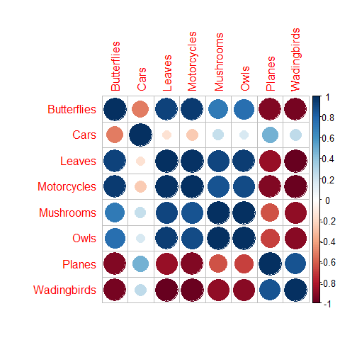

<!-- README.md is generated from README.Rmd. Please edit that file -->
vetnet
======

The goal of vetnet is to provide a set of tools to simulate the Vanderbilt Expertise Test (VET) <http://gauthier.psy.vanderbilt.edu/resources/>. The VET tests human object recognition performance over a variety of image categories. The vetnet package requires a distance matrix that describes how similar each pair of items in the VET is to one another. This can be generated via convolutional neural networks, raw images, human similarity ratings, etc. The vetnet provides an example distance matrix of all VET image pairs generated by the VGG-16 network. Using these distances, the vetnet package predicts object recognition accuracy and plots the resulting correlation matrix.

Installation
------------

### Prerequisites

1.  Install R: <https://www.r-project.org/> and
2.  Install Rstudio: <https://www.rstudio.com/>
3.  Install the devtools package by running the following in the RStudio console:

``` r
install.packages('devtools')
```

### Installing the package from GitHub

From RStudio:

``` r
devtools::install_github('jeff324/vetnet')
```

### Documentation

To see the detailed help docs, type the following into the RStudio console:

``` r
help(package='vetnet')
```

Example
-------

This is an example of how to use vetnet:

``` r
library(vetnet)

#make a list of parameters
par_list = make_parameter_list(num_subjects=10,par_names=c('c','beta'),lower=c(0,0),upper=c(1,1))

# set the model function
model = function(d,pars) {
     c = pars$c
     beta = pars$beta
     p = sapply(d, function(d) exp(-c*d) / (exp(-c*d) + beta))
     p = p[1] / sum(p) #probability of picking target 
}

#run the simulation
response_lists = run_vet(vet_list, dst, model, par_list)

#get the correlation matrix
corr_mat = get_corr_matrix(response_lists)

#plot correlation matrix
corrplot::corrplot(corr_mat)
```


